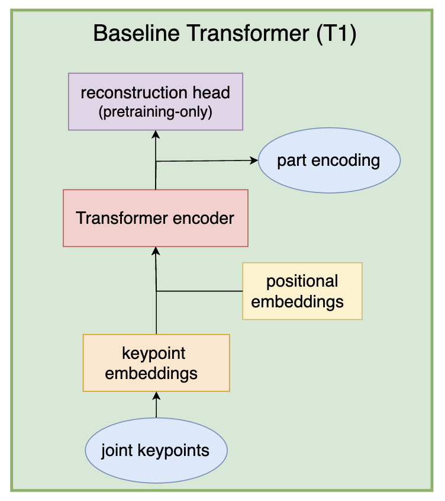
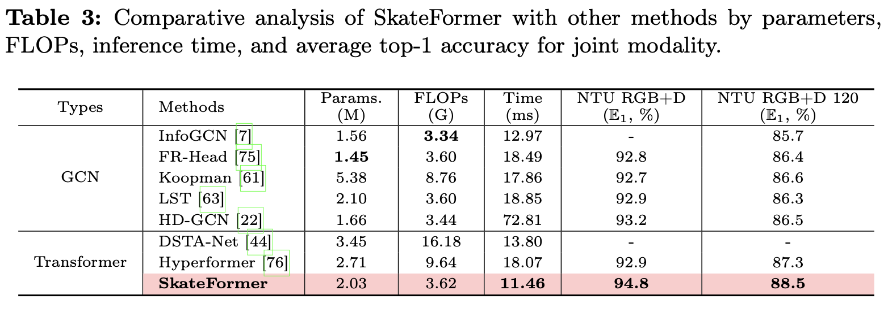
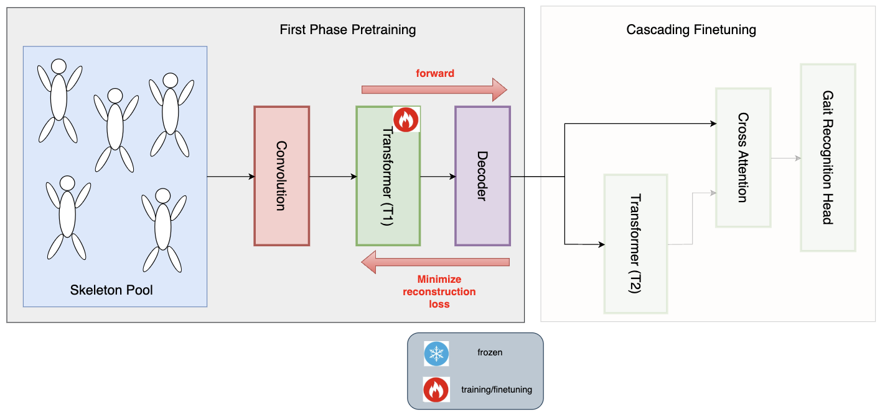
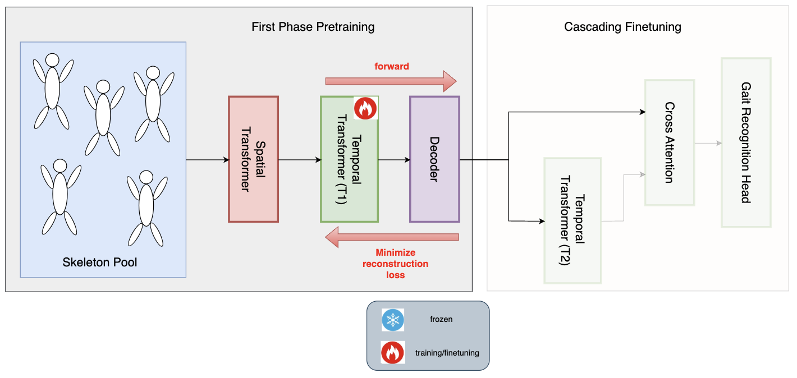
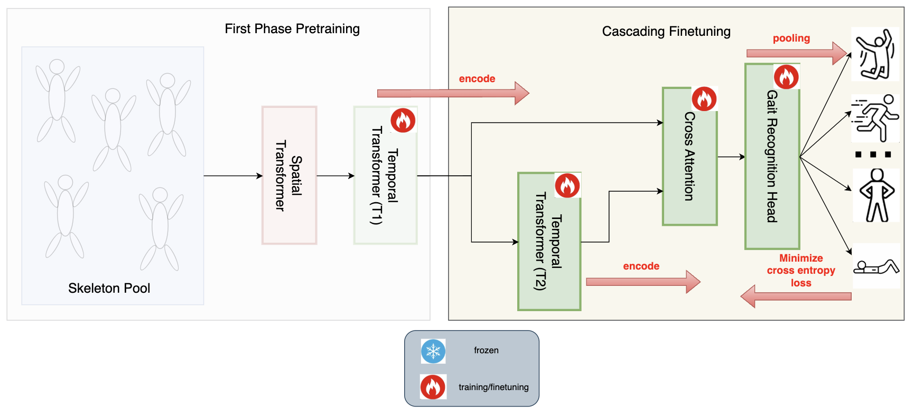

# 🌊 CascadeFormer: Two-stage Cascading Transformer for Human Action Recognition

The base (temporal) transformer:

Positional embeddings in T1 are **temporal** positions (encode the **frame numbers**) - **indispensable**!

## Model scale summary

| version | hidden size, layers, heads | total # parameters |
| ------- | ------------------ | ---------------- |
| CascadeFormer 1.1 | 256, 4, 8 | 11.0M |
| CascadeFormer 1.1 | 256, 4, 8 | 11.3M |
| CascadeFormer 1.2 | 256, 4, 8 | 12.6M |

SoTA:

## CascadeFormer 1.0

Pretraining:

Cascading Finetuning:

### result leaderboard - CascadeFormer 1.0

| dataset | #videos | #actions | dimension | #joints | outperform SoTA? |
| ------- | ------- | -------- | --------- | ---------- | ------- |
| Penn Action | 2,326 | 15 | 2D | 13 | **94.66%** > 93.4% (HDM-BG) |
| N-UCLA | 1,494 | 12 | 3D | 20 | **88.79%** < 98.3% (SkateFormer) |
| NTU/CS | 56,880 | 60 | 3D | 25 | **75.22%** << 92.6% (SkateFormer) - cross subject |
| <tr><td colspan="6" align="center"> **Bone** data representation ablation study </td></tr> |
| Penn Action, subtraction-bone | 2,326 | 15 | 2D | 13 | **92.32%** ~ 93.4% (HDM-BG) |
| Penn Action, concatenation-bone | 2,326 | 15 | 2D | 13 | **93.16%** ~ 93.4% (HDM-BG) |
| Penn Action, parameterization-bone | 2,326 | 15 | 2D | 13 | **93.91%** > 93.4% (HDM-BG) |
| N-UCLA, subtraction-bone | 1,494 | 12 | 3D | 20 | **85.56%** < 98.3% (SkateFormer) |
| N-UCLA, concatenation-bone | 1,494 | 12 | 3D | 20 | **88.15%** < 98.3% (SkateFormer) |
| NTU/CS, subtraction-bone | 56,880 | 60 | 3D | 25 | **74.23%** << 92.6% (SkateFormer) - cross subject |
| NTU/CS, concatenation-bone | 56,880 | 60 | 3D | 25 | **73.81%** << 92.6% (SkateFormer) - cross subject |

corresponding model checkpoints:

1. Penn Action: **94.66%** [google drive](https://drive.google.com/drive/folders/1Za50ZE9ZEKdEps_ZE-JIbatTpLuMW83k)
2. N-UCLA: 88.79% is not good enough
3. NTU/CS: 75.22% is not good enough
4. NTU/CV: TBD

## CascadeFormer 1.1 (convolution enhanced)

Pretraining:

Cascading Finetuning:

### result leaderboard - CascadeFormer 1.1

| dataset | #videos | #actions | dimension | #joints | outperform SoTA? |
| ------- | ------- | -------- | --------- | ---------- | ------- |
| Penn Action | 2,326 | 15 | 2D | 13 | **94.10%** > 93.4% (HDM-BG) |
| N-UCLA | 1,494 | 12 | 3D | 20 | **91.16%** < 98.3% (SkateFormer) |
| NTU/CS | 56,880 | 60 | 3D | 25 | **70.68%** << 92.6% (SkateFormer) |
| NTU/CV | 56,880 | 60 | 3D | 25 | ??? << 92.6% (SkateFormer) |

corresponding model checkpoints:

1. Penn Action: **94.10%** [google drive](https://drive.google.com/drive/folders/1qbcT8DlhNyT3HgbM3j2aEQP2rSXoEJRS)
2. N-UCLA: **91.16%** [google drive](https://drive.google.com/drive/folders/1b0IuO_XY-Gwv4RjS6gF9gPG36uvGwhha); **90.52%** [google drive](https://drive.google.com/drive/folders/10v1zGGhziiRZdXO2mDU-db_keVmmeUNY) 
3. NTU/CS: **72.22%** is not good enough; running: CUDA_VISIBLE_DEVICES=0 taskset -c 26-35 python3 baseline/action_recognition/cascadeformer_1_1/joint/ntu_60_own/NTU_main.py --pretrain --num_epochs 500 > NTU_1_1_pretrain.txt 2>&1 &
4. NTU/CV: TBD

## CascadeFormer 1.2 (spatial-transformer enhanced)

Spatial transformer: reshape input into (BxT, J, D) instead of (B, T, JxD)

Pretraining:

Cascading Finetuning:

### result leaderboard - CascadeFormer 1.2

| dataset | #videos | #actions | dimension | #joints | outperform SoTA? |
| ------- | ------- | -------- | --------- | ---------- | ------- |
| Penn Action | 2,326 | 15 | 2D | 13 | **94.10%** > 93.4% (HDM-BG) |
| N-UCLA | 1,494 | 12 | 3D | 20 | 98.3% (SkateFormer) |
| NTU/CS | 56,880 | 60 | 3D | 25 | 92.6% (SkateFormer) |
| NTU/CV | 56,880 | 60 | 3D | 25 | 92.6% (SkateFormer) |

corresponding model checkpoints:

1. Penn Action: **94.01%** [google drive](https://drive.google.com/drive/folders/1jAlH7pf-zaHy7CVIF3MAmiZ5mMtDw2j-), **94.10%** [google drive](https://drive.google.com/drive/folders/1Jl7lIVcbqw6W2xzvf09nVRERXHIFrjXn)
2. N-UCLA:
3. NTU/CS: TBD
4. NTU/CV: TBD

## Leaderboard - CascadeFormer 2.0

Baseline Transformer (T1 and T2):

First-stage pretraining:

Second-stage pretraining:

Finetuning:

| dataset | #videos | #actions | dimension | #joints | outperform SoTA? |
| ------- | ------- | -------- | --------- | ---------- | ------- |
| Penn Action, joint | 2,326 | 15 | 2D | 13 | ??? < 93.4% (HDM-BG) |
| N-UCLA, joint | 1,494 | 12 | 3D | 20 | ??? < 98.3% (SkateFormer) |
| NTU, joint | 56,880 | 60 | 3D | 25 | ??? << 92.6% (SkateFormer) - cross subject |

# Remaining potential datasets 

| dataset | #videos | #actions | dimension | #joints | outperform SoTA? |
| ------- | ------- | -------- | --------- | ---------- | ------- |
| <tr><td colspan="6" align="center"> the remaining part of the leaderboard is not done yet... </td></tr> |
| NTU | 56,880 | 60 | 3D | 25 | N/A < 92.6% (SkateFormer) - cross view |
| NTU 120 | 114,480 | 120 | 3D | 25 | N/A < 87.7%  (SkateFormer) - cross subject |
| NTU 120 | 114,480 | 120 | 3D | 25 | N/A < 89.3%  (SkateFormer) - cross view |
| Skeletics-152 | 125,657 | 152 | 3D | 25 | N/A < 56.39% (MS-G3D) | 
