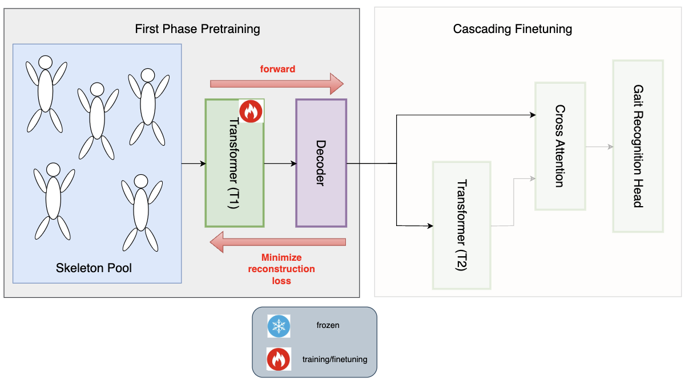
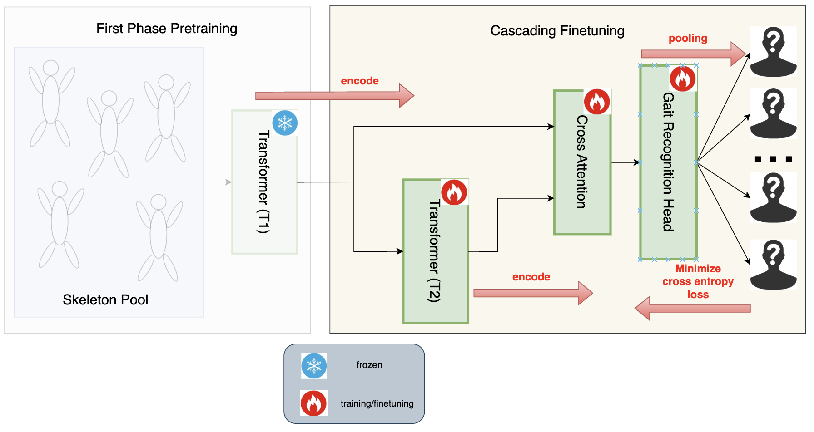

# BPMT: Body Part as Modality Transformer for Efficient and Accurate Gait Recognition

## Camera-View-Aware Data Preprocessing

Camera-View-Aware Data Preprocessing:

## Baseline Design

Baseline Transformer (T1 and T2):

Pretraining:

Cascading Finetuning:

## Baseline - Experiment

| #subject scanned | #subject actual | decoder | freeze T1? | T1-lr | #epochs | T2-lr (ft-lr) | #epochs | clf-acc | 
|------------------|------------------|------------|------------|--------|-------------|-------------|--------|------------|
| 50 | 27 | linear | yes | 1e-4 | 5000 | 1e-6, wd=1e-4 | 20 | 22.30% | 
| 50 | 27 | linear | no  | 1e-4 | 5000 | 1e-5, wd=1e-5 | 20 | 20.86% |

## BPMT 1.0 - Design

BPMT 1.0 Transformer and Baseline Transformer are the same.

First-stage pretraining:

Second-stage pretraining:

Finetuning:

## BPMT 1.0 - Experiment

| #subject scanned | #subject actual | decoder | freeze T1? | T1-lr | #epochs | freeze T2? | T1-lr | #epochs | ft-lr | ft-#epochs | clf-acc | 
|------------------|------------------|------------|------------|--------|-------------|-------------|--------|-------------|----------------|--------------------|--------------|
| 50 | 27 | linear | yes | 1e-4 | 1000 | yes | 1e-4 | 1000 | 1e-5, wd=1e-4 | 130 | 26.6% |
| 50 | 27 | linear | yes | 1e-4 | 1000 | no | 1e-4 | 1000 | 1e-5, wd=1e-4 | 130 | 25.9% |           
| 300 | 109 | linear | yes | 1e-4 | 1000 | yes | 1e-4 | 1000 | 1e-6, wd=1e-4 | 400 | 6% |
| 300 | 109 | linear | yes | 1e-4 | 1000 | yes | 1e-4 | 1000 | 1e-6, wd=1e-4 | 1000 | 7.35% | 

## Conda environment setup

BPMT_env - stay tuned!

## Current issue: overfitting

✅ fixing the bug of not saving pretrained cross-attention module properly

✅ severe underfitting during pretraining & finetuning

✅ hyperparameter tuning - smaller learning rate

✅ hyperparameter tuning - weight decay

❌ hyperparameter tuning - cosine scheduler?

❌ no early stopping (save the best checkpoint needed)

## Gait3D dataset

they have 3000/1000 train/test split, where 1000 people in the test set are **brand new people**. I think I might have misunderstood the nature of gait recognition and used the wrong training **objective** - it's supposed to be "open-set instance retrieval setting" from Gait3D paper:

*"To facilitate the research, we split the 4,000 IDs of the Gait3D dataset into the train/test subsets with 3,000/1,000 IDs, respectively. For the test set, we further randomly select one sequence from each ID to build the query set with 1,000 sequences, while the rest of the sequences become the gallery set with 5,369 sequences. Our evaluation protocol is based on the open-set instance retrieval setting like existing gait recognition datasets [17] and the person ReID task [60]. Given a query sequence, we measure its similarity between all sequences in the gallery set. Then a ranking list of the gallery set is returned by the descending order of the similarities. We report the average Rank-1 and Rank-5 identification rates over all query sequences. We also adopt the mean Average Precision (mAP) and mean Inverse Negative Penalty (mINP) [55] which consider the recall of multiple instances and hard samples."*

## Existing Gait recognition evaluation results 

The following papers give a nice overview of POSE-ONLY gait recognition

"GaitPT: Skeletons Are All You Need For Gait Recognition" (CVPR'23): they use a very complicated four-stage training (joint, limb, limb group, body), which is (unfortuately) very similar to our design. GaitPT uses three datasets: CASIA-B, GREW, Gait3D for evaluation. In GaitPT, multiple evaluation metrics are used: rank-1 accuracy, rank-5 accuracy. it shows the following results for Gait 3D specifically:

similar results in "SkeletonGait: Gait Recognition Using Skeleton Maps" (CVPR'23):

## Q&A section

1. I think I need to change the downstream training objective: classification cross entropy loss -> metric learning triplet loss (two-stage pretraining is supposed to be fine since it's basically doing reconstruction and learning body encodings); I also have to **manually** construct the triplet dataset, which is also a non-trivial task.

## What "can" be the next step?

integrate IIP-Transformer and compare with the baseline (BPMT 2.0)

My Other ideas (from my past time series experience + NLP class):

1. try efficient attention mechanisms like FlowAttention, FlashAttention
2. dual encoder (noisy encoder + clean encoder) like DEPICT
3. add contrastive learning objective on top of cross attention like CLIP
4. add auxiliary classification objective (mix in fake samples) like DTCR
