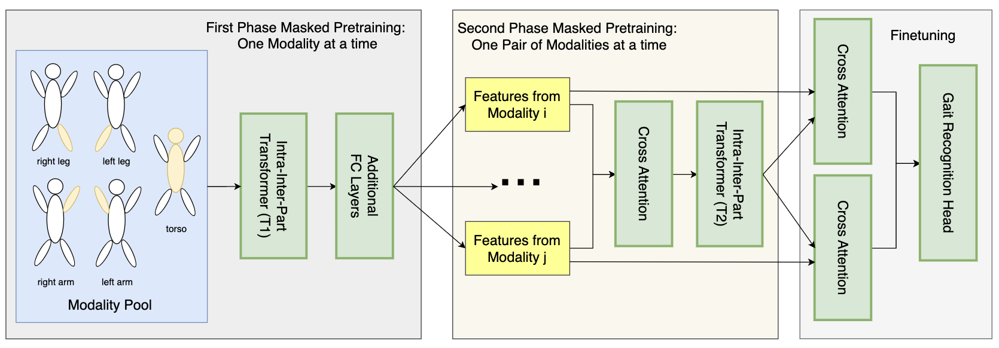
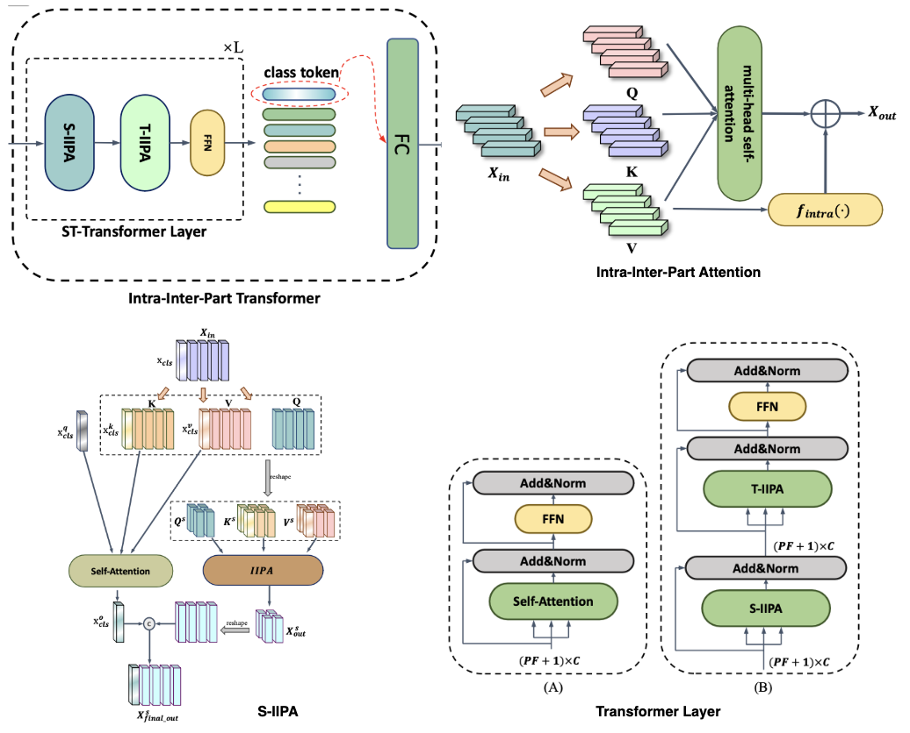

# BPMT: Body Part as Modality Transformer for Efficient and Accurate Gait Recognition

## Computer Vision Undergraduate Thesis Advised Dr. Alper Yilmaz

## proposed architecture

Our BPMT architecture design:

IIP-Transformer architecture:

## implementation roadmap

### First phase of masked pretraining (modality level)

- [x] load Gait3D data (a subset of Gait3D -- 50 subjects; original Gait3D has 4K subjects)

  - [x] load pose/keypoints data from Gait3D

  - [x] verify the correctness of the data loading process

- [x] build the modality pool (use inheritence if we wanna do some benchmarking with modality-free approches)
  - [x] partition original keypoints into 5 different parts/modalities
  - [x] verify the correctness of:
    - [x] torso
    - [x] left leg
    - [x] right leg
    - [x] left arm
    - [x] right arm

- [ ] implement IIP-Transformer (T1)
  - [ ] individual transformer layer
    - [ ] Intra-Inter-Part attention
    - [ ] S-IIPA
    - [ ] T-IIPA
    - [ ] complete the transformer layer

  - [ ] finish up the entire transformer
    - [ ] add class token
    - [ ] add FC layer

- [ ] add additional FC layers to reduce dimension

### Second phase of masked pretraining (modality pair level)

- [ ] construct pairs of features from modality i and modality j

- [ ] implement the cross attention layer

- [ ] implement another IIP-Transformer (T2), should be similar to T1
  - [ ] individual transformer layer
    - [ ] Intra-Inter-Part attention
    - [ ] S-IIPA
    - [ ] T-IIPA
    - [ ] complete the transformer layer

  - [ ] finish up the entire transformer
    - [ ] add class token
    - [ ] add FC layer

### Finetuning

- [ ] cross attention between transformer T2 output (the second phase of pretraining) and modality features (the first phase of pretraining)

- [ ] gait recognition head
