# BPMT: Body Part as Modality Transformer for Efficient and Accurate Gait Recognition

## research motivation

Although a massive number of gait recognition models have been proposed, and multiple architectures including IIP-Transformer, STSA-Net, and IGFormer have experimented with dividing the body poses explicitly into multiple meaningful parts or segments, no existing work has attempted to integrate body-part-aware transformers into the two-phase masked pretraining framework proposed in OmniVec2, which
was originally designed to learn multi-modal representations to perform multiple tasks. In this work, we attempt to address the following problem: can we treat different human parts as different modalities to integrate body-part-aware transformers into the two-phase masked pretraining framework proposed in OmniVec2?

## BPMT pipeline

## BPMT architecture

Our BPMT architecture design:
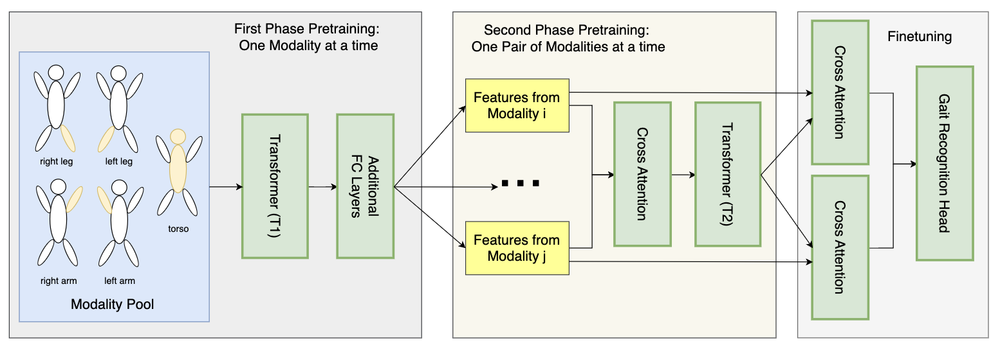

First-stage pretraining:

Second-stage pretraining:

Finetuning:

## IIP-Transformer (Q. Wang et. al, CVPR 2022)

IIP-Transformer architecture:

## implementation roadmap (implement IIP-Transformer later; use a basic transformer first)

week April 1 ~ April 8: 

1) finish the second stage of masked pretraining

2) scale up experiments - 50 too small!

3) implement validation during training

4) report plots/results of training + validation

### First phase of masked pretraining (modality level)

- [x] load Gait3D data (a subset of Gait3D -- 50 subjects; original Gait3D has 4K subjects)

  - [x] load pose/keypoints data from Gait3D

  - [x] verify the correctness of the data loading process

- [x] build the modality pool (use inheritence if we wanna do some benchmarking with modality-free approches)
  - [x] partition original keypoints into 5 different parts/modalities
  - [x] verify the correctness of:
    - [x] torso
    - [x] left leg
    - [x] right leg
    - [x] left arm
    - [x] right arm

- [x] modality-level masked training baseline T1 (we need to have quick prototype/baseline first to later compare with IIP-Transformer)
  - [x] we need a helper function to do masking for training
  - [x] then we can build a base transformer with PyTorch
    - [x] keypoint embeddings
    - [x] positional embeddings
    - [x] PyTorch built-in transformer encoder (this is our base transformer)
    - [x] reconstruction head
  - [x] implement the training loop for first-stage masked pretraining
  - [x] train the following 5 modalities:
    - [x] torso
    - [x] left arm
    - [x] right arm
    - [x] left leg
    - [x] right leg

- [ ] implement IIP-Transformer (T1)
  - [ ] individual transformer layer
    - [ ] Intra-Inter-Part attention
    - [ ] S-IIPA
    - [ ] T-IIPA
    - [ ] complete the transformer layer

  - [ ] finish up the entire transformer
    - [ ] add class token
    - [ ] add FC layer

- [ ] add additional FC layers for dimension reduction (hold it for now - add this simple component when it comes to IIP-Transformer)

### Second phase of masked pretraining (modality pair level)

- [x] construct pairs of features from modality i and modality j (we will have 5 choose 2 = 10 combinations/pairs in total)
  - [x] first of all, load single-modality checkpoints from the first training stage
  - [x] we can also freeze T1 (totally or partially) during second stage training

- [x] implement the cross attention layer

- [ ] implement another IIP-Transformer (T2), should be similar to T1 [hold this for now]
  - [ ] individual transformer layer
    - [ ] Intra-Inter-Part attention
    - [ ] S-IIPA
    - [ ] T-IIPA
    - [ ] complete the transformer layer

  - [ ] finish up the entire transformer
    - [ ] add class token
    - [ ] add FC layer
  
- [x] baseline T2
  - [x] transformer encoder
  - [x] reconstruction head

  - [x] implement the training loop for first-stage masked pretraining

### Finetuning

- [x] cross attention between transformer T2 output (the second phase of pretraining) and modality features (the first phase of pretraining)

- [x] gait recognition head

### Training Loss & Validation Loss - 50 subjects

#### first stage pretraining

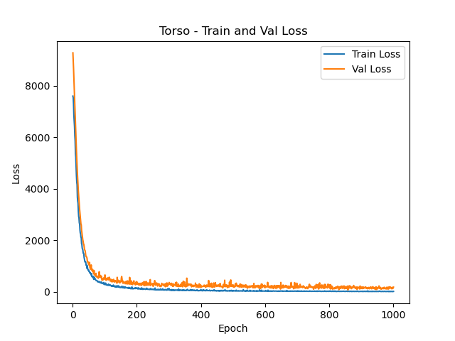

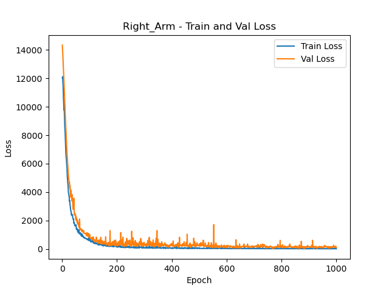

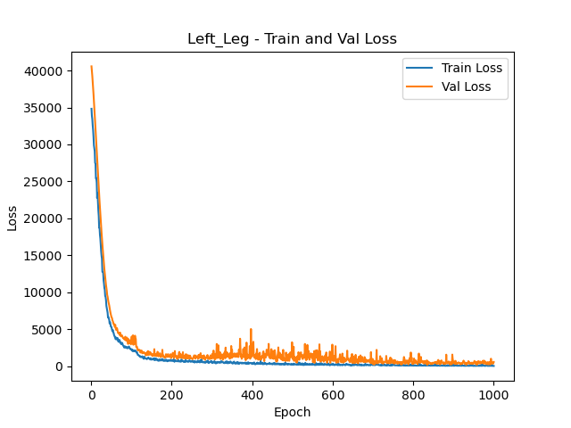

#### second stage pretraining

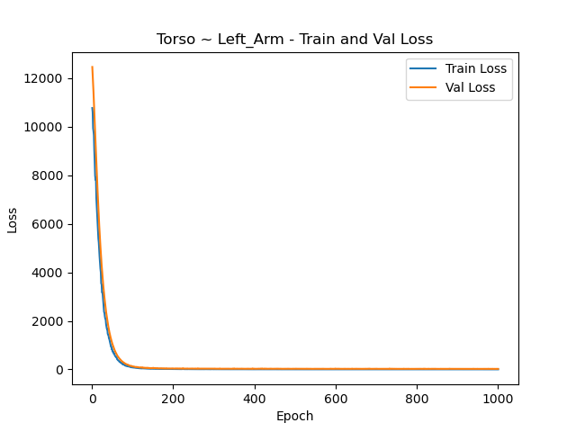

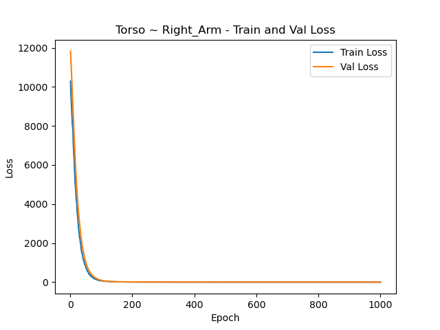

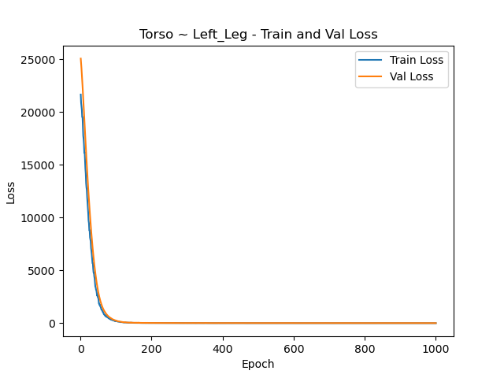

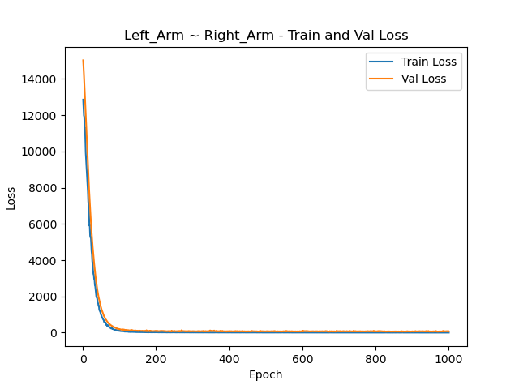

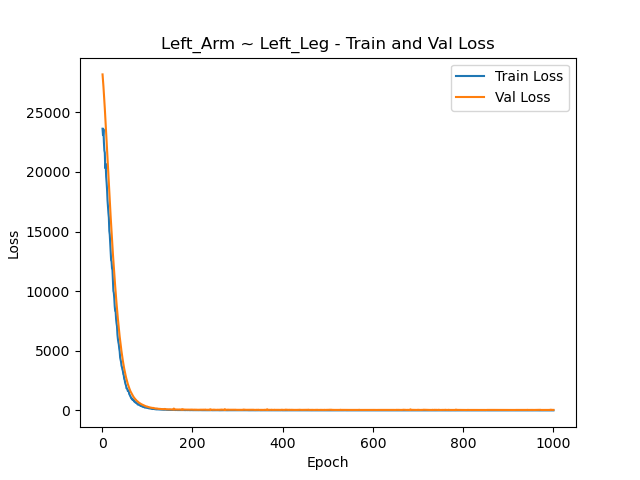

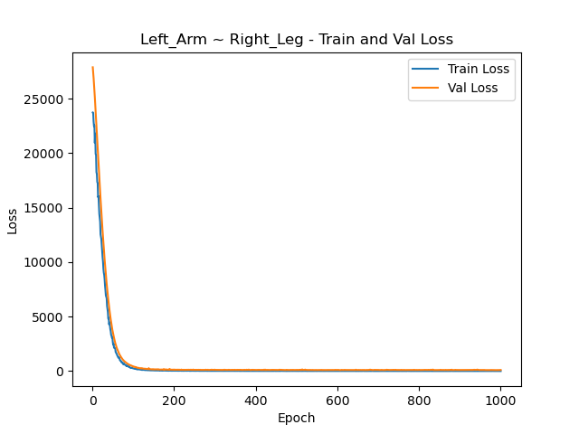

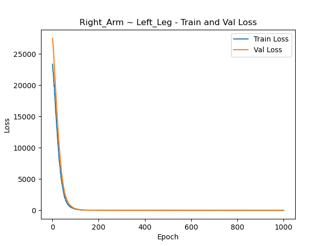

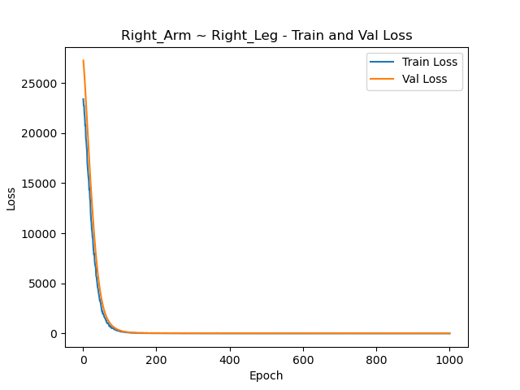

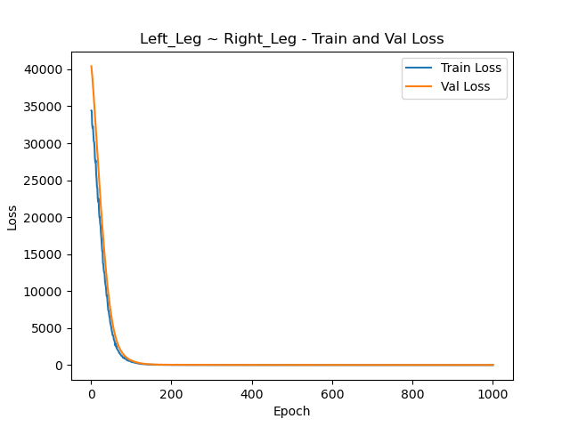

#### finetuning

Right now I am facing over overfitting issues:

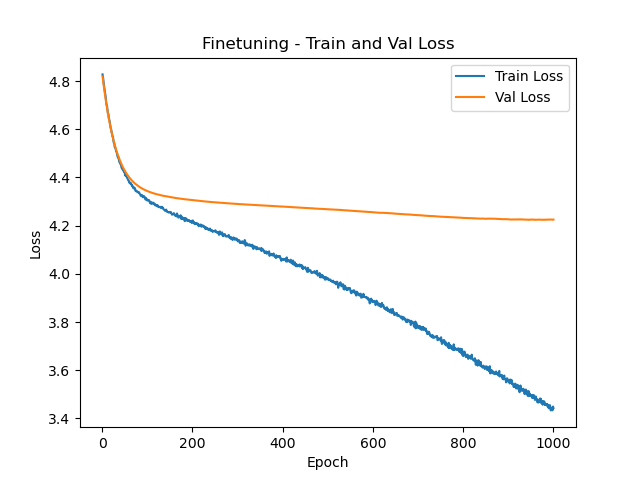

## Conda environment setup

BPMT_env - stay tuned!
