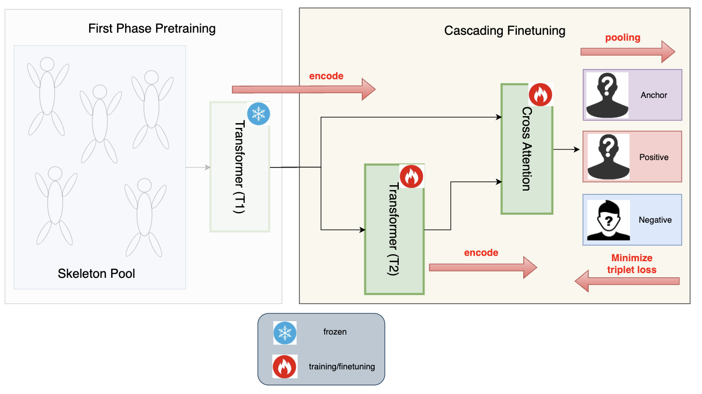
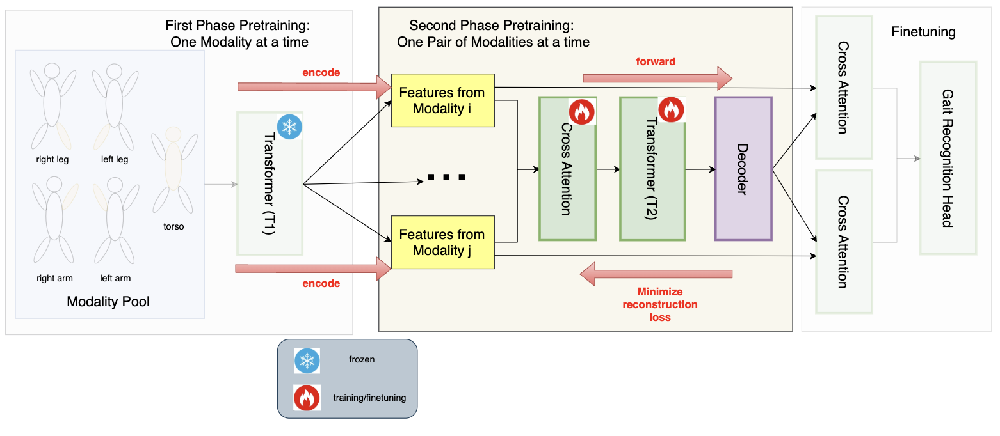

# BPMT: Body Part as Modality Transformer for Efficient and Accurate Gait Recognition

## Camera-View-Aware Data Preprocessing

Camera-View-Aware Data Preprocessing:

## Baseline Design (close-set classification)

Baseline Transformer (T1 and T2):

Pretraining:

Cascading Finetuning:

## Baseline - Design (open-set retrieval)

The definition of "open-set retrieval" from Gait3D paper:

*"Given a query sequence, we measure its similarity between all sequences in the gallery set. Then a ranking list of the gallery set is returned by the descending order of the similarities. We report the average Rank-1 and Rank-5 identification rates over all query sequences. We also adopt the mean Average Precision (mAP) and mean Inverse Negative Penalty (mINP) [55] which consider the recall of multiple instances and hard samples."*

Baseline Transformer (T1 and T2):

Pretraining:

Finetuning:

## BPMT 1.0 - Design (close-set classification)

BPMT 1.0 Transformer and Baseline Transformer are the same.

First-stage pretraining:

Second-stage pretraining:

Finetuning:

## BPMT 1.0 Design (open-set retrieval)

TBD

## Baseline - Experiment (close-set classification)

| #subject scanned | #subject actual | decoder | freeze T1? | T1-lr | #epochs | T2-lr (ft-lr) | #epochs | clf-acc | 
|------------------|------------------|------------|------------|--------|-------------|-------------|--------|------------|
| 50 | 27 | linear | yes | 1e-4 | 5000 | 1e-5, wd=1e-4 | 30 | 21.58% | 
| 50 | 27 | linear | no  | 1e-4 | 5000 | 1e-5, wd=1e-4 | 30 | 15.83% |
| 50 | 27 | linear | finetune layer #2 | 1e-4 | 5000 | 1e-5, wd=1e-4 | 30 | 12.95% |
| 300 | 109 | linear | yes | 1e-4 | 5000 | 1e-5, wd=1e-4 | 100 | 9.67% |
| 300 | 109 | linear | no | 1e-4 | 5000 | 1e-5, wd=1e-4 | 100 | 10.64% |
| 300 | 109 | linear | finetune layer #2 | 1e-4 | 5000 | 1e-5, wd=1e-4 | 100 | 10.64% |

## Baseline - Experiment (open-set retrieval)
| #subject scanned | #subject actual | decoder | freeze T1? | T1-lr | #epochs | T2-lr (ft-lr) | #epochs | R1-acc (seen people from training, but different cameras) | R1-acc (completely unseen people)
|------------------|------------------|------------|------------|--------|-------------|-------------|--------|--------------------------|--------------|
| 50 | 27 | linear | yes | 1e-4 | 5000 | 1e-5, wd=1e-4 | 100 | 30.94% | 15.75% |
| 50 | 27 | linear | no  | 1e-4 | 5000 | 1e-5, wd=1e-4 | 100 | 28.06% | 17.53% |
| 50 | 27 | linear | finetune layer #2 | 1e-4 | 5000 | 1e-5, wd=1e-4 | 100 | 30.22% | 14.71% |
| 300 | 109 | linear | yes | 1e-4 | 5000 | 1e-5, wd=1e-4 | 500 | 13.54% | 12.54% |
| 300 | 109 | linear | no | 1e-4 | 5000 | 1e-5, wd=1e-4 | 30 | 10.06% | 6.24% |
| 300 | 109 | linear | finetune layer #2 | 1e-4 | 5000 | 1e-5, wd=1e-4 | 30 | 12.57% | 7.02% |

## BPMT 1.0 - Experiment (close-set classification)

| #subject scanned | #subject actual | decoder | freeze T1? | T1-lr | #epochs | freeze T2? | T1-lr | #epochs | ft-lr | ft-#epochs | clf-acc | 
|------------------|------------------|------------|------------|--------|-------------|-------------|--------|-------------|----------------|--------------------|--------------|
| 50 | 27 | linear | yes | 1e-4 | 1000 | yes | 1e-4 | 1000 | 1e-5, wd=1e-4 | 130 | 26.6% |
| 50 | 27 | linear | yes | 1e-4 | 1000 | no | 1e-4 | 1000 | 1e-5, wd=1e-4 | 130 | 25.9% |           
| 300 | 109 | linear | yes | 1e-4 | 1000 | yes | 1e-4 | 1000 | 1e-6, wd=1e-4 | 400 | 6% |
| 300 | 109 | linear | yes | 1e-4 | 1000 | yes | 1e-4 | 1000 | 1e-6, wd=1e-4 | 1000 | 7.35% | 

## BPMT 1.0 Experiment (open-set retrieval)
| #subject scanned | #subject actual | decoder | freeze T1? | T1-lr | #epochs | freeze T2? | T1-lr | #epochs | ft-lr | ft-#epochs | R1-acc (seen people from training) | 
|------------------|------------------|------------|------------|--------|-------------|-------------|--------|-------------|----------------|--------------------|--------------|

## Existing State-of-the-art

PoseGait, GaitGraph, GaitFormer, GaitPT:

GaitGraph2, GaitTR, GPGait:

GaitDIF:

## What "could" be the next step?

integrate IIP-Transformer and compare with the baseline (BPMT 2.0)

My Other ideas (from my past time series experience + NLP class):

1. try efficient attention mechanisms like FlowAttention, FlashAttention
2. dual encoder (noisy encoder + clean encoder) like DEPICT
3. add contrastive learning objective on top of cross attention like CLIP
4. add auxiliary classification objective (mix in fake samples) like DTCR
