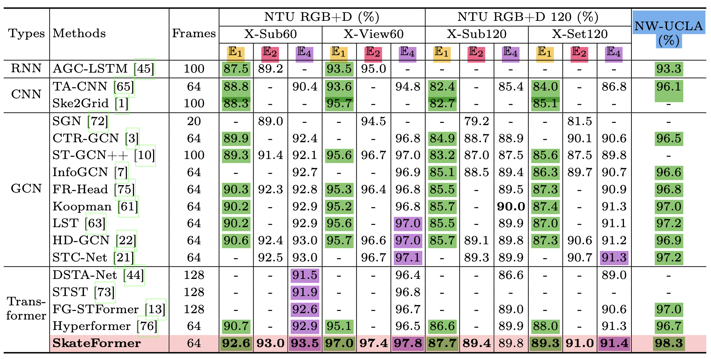

# Complete Tuning Log

## Penn Action

3DA (best) with Pr-VIPE, UNIK, HDM-BG, 3D Deep, PoseMap, MultitaskCNN, STAR: 

The complete experiment tuning logs:

| masked pretraining | decoder | d_model | n_head | num_layers | freeze T1? | T1-lr | #epochs | T2-lr (ft-lr) | #epochs | clf-acc | 
|------------------|------------|------------|------------|------------|------------|--------|-------------|-------------|--------|------------|
| <tr><td colspan="11" align="center">Complete Experiments, 15% held-out validation (n = 2326)</td></tr> |
| no | linear | 64 | 4 | 2 | yes | 1e-4 | 1000 | 1e-5, wd=1e-4 | 500 | 84.93% |
| no | linear | 64 | 4 | 2 | no  | 1e-4 | 1000 | 1e-5, wd=1e-4 | 500 | 85.96% |
| no | linear | 64 | 4 | 2 | finetune layer #2 | 1e-4 | 1000 | 1e-5, wd=1e-4 | 500 | 87.36% |
| <tr><td colspan="11" align="center">Complete Experiments. 5% held-out validation (n = 2326)</td></tr> |
| no | linear | 64 | 4 | 2 | yes | 1e-4 | 1000 | 1e-5, wd=1e-4 | 500 | 83.71% |
| no | linear | 64 | 4 | 2 | no  | 1e-4 | 1000 | 1e-5, wd=1e-4 | 500 | 86.89% |
| no | linear | 64 | 4 | 2 | finetune layer #2 | 1e-4 | 1000 | 1e-5, wd=1e-4 | 500 | 88.95% |
| no | linear | 256 | 8 | 4 | yes | 1e-4 | 1000 | 1e-5, wd=1e-4 | 500 | 85.11% |
| no | linear | 256 | 8 | 4 | no  | 1e-4 | 1000 | 1e-5, wd=1e-4 | 200 | 89.70% |
| no | linear | 256 | 8 | 4 | no  | 1e-4 | 1000 | 1e-5, wd=1e-4 | **400** | **91.10%** |
| no | linear | 256 | 8 | 4 | no  | 1e-4 | 1000 | 1e-5, wd=1e-4 | **500** | **91.01%** |
| no | linear | 256 | 8 | 4 | no  | 1e-4 | 1000 | 1e-5, wd=1e-4 | 700 | 89.42% |
| no | linear | 256 | 8 | 4 | finetune layer #4 | 1e-4 | 1000 | 1e-5, wd=1e-4 | 400 | 86.89% |
| no | linear | 256 | 8 | 4 | finetune layer #4 | 1e-4 | 1000 | 1e-5, wd=1e-4 | 490 | 88.39% |
| no | MLP | 256 | 8 | 4 | no  | 1e-5 | 1000 | 1e-5, wd=1e-4 | 600 | 89.51% |
| no | MLP | 256 | 8 | 4 | no  | 1e-5 | 1000 | 1e-5, wd=1e-4 | 700 | 90.45% |
| no | MLP | 256 | 8 | 4 | no  | 1e-5 | 1000 | 1e-5, wd=1e-4 | 1000 | 89.89% |
| <tr><td colspan="11" align="center"> 30% masked pretraining - random **frames** </td></tr> |
| 30% | linear | 256 | 8 | 4 | no | 1e-4 | 500 | 1e-5, wd=1e-4 | 500 | 87.17% |
| 30% | linear | 256 | 8 | 4 | no | 1e-4 | 500 | 1e-5, wd=1e-4 | 700 | 87.27% |
| 30% | linear | 256 | 8 | 4 | no | 1e-4 | 500 | 1e-5, wd=1e-4 | 1000 | **89.23%** | 
| 30% | linear | 256 | 8 | 4 | no | 1e-4 | 500 | 1e-5, wd=1e-4 | 1500 | 87.73% | 
| 30% | MLP | 256 | 8 | 4 | no | 1e-4 | 500 | 1e-5, wd=1e-4 | 500 | 86.89% |
| 30% | MLP | 256 | 8 | 4 | no | 1e-4 | 500 | 1e-5, wd=1e-4 | 1000 | 87.45% |
| 30% | linear | 256 | 8 | 4 | no | 1e-4 | 1K | 1e-5, wd=1e-4 | 500 | 89.70% |
| 30% | linear | 256 | 8 | 4 | no | 1e-4 | 1K | 1e-5, wd=1e-4 | 1000 | **89.98%** |
| 30% | linear | 256 | 8 | 4 | no | 1e-4 | 2K | 1e-5, wd=1e-4 | 1000 | 87.36% |
| <tr><td colspan="11" align="center"> *cosine scheduler* didn't improve the performance... </td></tr> |
| 30% | linear | 256 | 8 | 4 | no | 1e-4, batch-cosine | 300 | 1e-5, wd=1e-4 | 500 | 86.99% |
| 30% | linear | 256 | 8 | 4 | no | 1e-4, batch-cosine | 300 | 1e-5, wd=1e-4 | 1000 | **88.20%** |
| 30% | linear | 256 | 8 | 4 | no | 1e-4, batch-cosine | 300 | 1e-5, wd=1e-4 | 1200 | 87.92% |
| 30% | linear | 256 | 8 | 4 | no | 1e-4, batch-cosine | 300 | 1e-5, wd=1e-4, epoch-cosine | 800 | 86.52% |
| 30% | linear | 256 | 8 | 4 | no | 1e-4, batch-cosine | 300 | 1e-5, wd=1e-4, epoch-cosine | 1000 | 86.80% |
| 30% | linear | 256 | 8 | 4 | no | 1e-4, batch-cosine | 300 | 1e-5, wd=1e-4, epoch-cosine | 1500 | 86.80% |
| <tr><td colspan="11" align="center"> 40% masked pretraining - random frames </td></tr> |
| 40% | linear | 256 | 8 | 4 | no | 1e-4 | 500 | 1e-5, wd=1e-4 | 400 | 87.55% |
| 40% | linear | 256 | 8 | 4 | no | 1e-4 | 500 | 1e-5, wd=1e-4 | 500 | **88.20%** |
| 40% | linear | 256 | 8 | 4 | no | 1e-4 | 500 | 1e-5, wd=1e-4 | 600 | 87.36% |
| 40% | linear | 256 | 8 | 4 | no | 1e-4 | 500 | 1e-5, wd=1e-4 | 700 | 87.83% |
| <tr><td colspan="11" align="center"> 20% masked pretraining - random frames  </td></tr> |
| 40% | linear | 256 | 8 | 4 | no | 1e-4 | 500 | 1e-5, wd=1e-4 | 400 | 87.73% |
| 40% | linear | 256 | 8 | 4 | no | 1e-4 | 500 | 1e-5, wd=1e-4 | 500 | 88.67% |
| 40% | linear | 256 | 8 | 4 | no | 1e-4 | 500 | 1e-5, wd=1e-4 | 700 | **89.04%** |
| 40% | linear | 256 | 8 | 4 | no | 1e-4 | 500 | 1e-5, wd=1e-4 | 1000 | 88.30% |
| 40% | linear | 256 | 8 | 4 | no | 1e-4 | 500 | 1e-5, wd=1e-4 | 1000 | 88.39% |
| <tr><td colspan="11" align="center"> 30% masked pretraining - random global joints  </td></tr> |
| 30% | linear | 256 | 8 | 4 | no | 1e-4 | 200 | 1e-5, wd=1e-4 | 200 | 91.48% |
| 30% | linear | 256 | 8 | 4 | no | 1e-4 | 200 | 1e-5, wd=1e-4 | 500 | 91.01% |
| 30% | linear | 256 | 8 | 4 | no | 1e-4 | 300 | 1e-5, wd=1e-4 | 200 | 91.67% |
| 30% | linear | 256 | 8 | 4 | no | 1e-4 | 300 | 1e-5, wd=1e-4 | 300 | 92.42% |
| 30% | linear | 256 | 8 | 4 | no | 1e-4 | 300 | 1e-5, wd=1e-4 | 350 | 91.76% |
| 30% | linear | 256 | 8 | 4 | no | 1e-4 | 300 | 1e-5, wd=1e-4 | 400 | 91.95% |
| 30% | linear | 256 | 8 | 4 | no | 1e-4 | 300 | 1e-5, wd=1e-4 | 500 | 91.39% |
| 30% | linear | 256 | 8 | 4 | no | 1e-4 | 500 | 1e-5, wd=1e-4 | 200 | 91.48% |
| 30% | linear | 256 | 8 | 4 | no | 1e-4 | 500 | 1e-5, wd=1e-4 | 300 | 91.57% |
| 30% | linear | 256 | 8 | 4 | no | 1e-4 | 500 | 1e-5, wd=1e-4 | 500 | 91.57% |
| 30% | linear | 256 | 8 | 4 | no | 1e-4 | 600 | 1e-5, wd=1e-4 | 200 | 91.20% |
| 30% | linear | 256 | 8 | 4 | no | 1e-4 | 600 | 1e-5, wd=1e-4 | 300 | 92.88% |
| 30% | linear | 256 | 8 | 4 | no | 1e-4 | 600 | 1e-5, wd=1e-4 | 400 | 92.42% |
| 30% | linear | 256 | 8 | 4 | no | 1e-4 | 600 | 1e-5, wd=1e-4 | 500 | 91.57% |
| 30% | linear | 256 | 8 | 4 | no | 1e-4 | 600 | 1e-5, wd=1e-4 | 600 | 92.13% |
| 30% | linear | 256 | 8 | 4 | no | 1e-4 | 600 | 1e-5, wd=1e-4 | 900 | 92.42% |
| 30% | linear | 256 | 8 | 4 | no | 1e-4 | 600 | 1e-5, wd=1e-4 | 1000 | 91.95% |
| 30% | linear | 256 | 8 | 4 | no | 1e-4 | **1000** | 1e-5, wd=1e-4 | **1000** | **94.66%** |
| <tr><td colspan="11" align="center"> ablation study: **too many layers** can cause overfitting... </td></tr> |
| 30% | linear | 512 | 8 | 8 | no | 1e-5 | 300 | 1e-5, wd=1e-4 | 100 | 89.89% |
| 30% | linear | 512 | 8 | 8 | no | 1e-5 | 300 | 1e-5, wd=1e-4 | 300 | 86.52% |
| <tr><td colspan="11" align="center"> ablation study: subtraction-based bones </td></tr> |
| 30%, subtraction-bone | linear | 256 | 8 | 4 | no | 1e-4 | 200 | 1e-5, wd=1e-4 | 200 | 91.76% |
| 30%, subtraction-bone | linear | 256 | 8 | 4 | no | 1e-4 | 1000 | 1e-5, wd=1e-4 | 300 | 91.67% |
| 30%, subtraction-bone | linear | 256 | 8 | 4 | no | 1e-4 | 1000 | 1e-5, wd=1e-4 | 500 | **92.32%** |
| 30%, subtraction-bone | linear | 256 | 8 | 4 | no | 1e-4 | 1000 | 1e-5, wd=1e-4 | 700 | 92.32% |
| 30%, subtraction-bone | linear | 256 | 8 | 4 | no | 1e-4 | 1000 | 1e-5, wd=1e-4 | 1000 | 90.92% |
| <tr><td colspan="11" align="center"> ablation study: concatenation-based bones </td></tr> |
| 30%, subtraction-bone | linear | 256 | 8 | 4 | no | 1e-4 | 200 | 1e-5, wd=1e-4 | 200 | 90.26% |
| 30%, subtraction-bone | linear | 256 | 8 | 4 | no | 1e-4 | 1000 | 1e-5, wd=1e-4 | 500 | 92.51% |
| 30%, subtraction-bone | linear | 256 | 8 | 4 | no | 1e-4 | 1000 | 1e-5, wd=1e-4 | 1000 | **93.16%** |
| <tr><td colspan="11" align="center"> ablation study: parameterization-based bones </td></tr> |
| 30%, subtraction-bone | linear | 256 | 8 | 4 | no | 1e-4 | 1000 | 1e-5, wd=1e-4 | 500 | **93.91%** |
| 30%, subtraction-bone | linear | 256 | 8 | 4 | no | 1e-4 | 1000 | 1e-5, wd=1e-4 | 1000 | 93.45% |

| <tr><td colspan="11" align="center"> CascadeFormer 1.1 (spatial-aware) </td></tr> |
| 30% | linear | 256 | 8 | 4 | no | 1e-4 | 200 | 1e-5, wd=1e-4 | 200 | **93.35%** |

## NTU RGB+D 60

Many folks have done data augmentation (still using only skeleton data):

1. E1: joint modality only
2. E2: joint + bone modalities
3. E4: joint + bone + joint motion + bone motion modalities

People usually: 

*train separate networks for each modality and ensemble their outputs*

The current best training setup (95%-5% train-val split):

cross-subject evaluation

## The complete experiment tuning logs

cross-subject evaluation:
| masked pretraining | decoder | d_model | n_head | num_layers | freeze T1? | T1-lr | #epochs | T2-lr (ft-lr) | #epochs | accuracy |
|--------------------|---------|---------|--------|------------|------------|--------|----------|----------------|----------|----------|
| <tr><td colspan="11" align="center"> multiple bodies: **skipping** </td></tr> |
| <tr><td colspan="11" align="center"> **regular** pretraining </td></tr> |
| no | linear | 256 | 8 | 4 | no | 1e-4 | 100 | 1e-5, wd=1e-4 | 20 | 70.19% |
| no | linear | 256 | 8 | 4 | no | 1e-4 | 100 | 1e-5, wd=1e-4 | 50 | 70.46% |
| no | linear | 256 | 8 | 4 | no | 1e-4 | 300 | 1e-5, wd=1e-4 | 50 | 71.33% |
| no | linear | 256 | 8 | 4 | no | 1e-4 | 300 | 1e-5, wd=1e-4 | 100 | 71.91% |
| <tr><td colspan="11" align="center"> 30% masked pretraining - random frames </td></tr>  |
| 30% | linear | 256 | 8 | 4 | no | 1e-4 | 100 | 1e-5, wd=1e-4 | 50 | 70.08% |
| 30% | linear | 256 | 8 | 4 | no | 1e-4 | 100 | 1e-5, wd=1e-4 | 100 | 70.45% |
| 30% | linear | 256 | 8 | 4 | no | 1e-4 | 100 | 1e-5, wd=1e-4 | 300 | 71.67% |
| <tr><td colspan="11" align="center"> 30% masked pretraining - random global joints </td></tr> |
| 30% | linear | 256 | 8 | 4 | no | 1e-4 | 100 | 1e-5, wd=1e-4 | 100 | 71.27% |
| 30% | linear | 256 | 8 | 4 | no | 1e-4 | 100 | 1e-5, wd=1e-4 | 200 | 70.24% |
| 30% | linear | 256 | 8 | 4 | no | 1e-4 | 300 | 1e-5, wd=1e-4 | 300 | 72.65% |
| 30% | linear | 256 | 8 | 4 | no | 1e-4 | 300 | 1e-5, wd=1e-4 | 500 | 72.31% |
| 30% | linear | 256 | 8 | 4 | no | 1e-4 | 500 | 1e-5, wd=1e-4 | 100 | 72.32% |
| 30% | linear | 256 | 8 | 4 | no | 1e-4 | 500 | 1e-5, wd=1e-4 | 500 | 71.99% |
| 30% | linear | 256 | 8 | 4 | no | 1e-4 | 500 | 3e-5, wd=1e-4, cosine + warmup | 100 | 72.33% |
| 30% | linear | 256 | 8 | 4 | no | 1e-4 | 500 | 3e-5, wd=1e-4, cosine + warmup | 300 | **73.21%** |
| 30% | linear | 256 | 8 | 4 | no | 1e-4 | 500 | 3e-5, wd=1e-4, cosine + warmup | 500 | 72.94% |
| <tr><td colspan="11" align="center"> strong backbone </td></tr> |
| 30% | linear | 256 | 8 | 4 | no | 1e-4 | **1000** | 3e-5, wd=1e-4, cosine + warmup | 300 | **73.56%** |
| 30% | linear | 256 | 8 | 4 | no | 1e-4 | **1000** | 3e-5, wd=1e-4, cosine + warmup | 500 | 73.17% |
| 30% | linear | 256 | 8 | 4 | no | 1e-4 | **1000** | 3e-5, wd=1e-4, cosine + warmup | 1000 | 72.51% |
| <tr><td colspan="11" align="center"> larger model </td></tr> |
| 30% | linear | 512 | 8 | 8 | no | 1e-4 | 200 | 1e-5, wd=1e-4 | 100 | **74.79%** |
| 30% | linear | 512 | 8 | 8 | no | 1e-4 | 200 | 1e-5, wd=1e-4 | 200 | 74.75% |
| <tr><td colspan="11" align="center"> ablation study: subtraction-based bones </td></tr> |
| 30% | linear | 512 | 8 | 8 | no | 1e-4 | 100 | 1e-5, wd=1e-4 | 100 | **74.23%** |
| <tr><td colspan="11" align="center"> ablation study: concatenation-based bones </td></tr> |
| 30% | linear | 512 | 8 | 8 | no | 1e-4 | 100 | 1e-5, wd=1e-4 | 100 | **73.81%** |
| <tr><td colspan="11" align="center"> cross-view evaluation </td></tr> |
| no | linear | 256 | 8 | 4 | no | 1e-4 | 300 | 1e-5, wd=1e-4 | 100 | Need to run one here... |

Attempted to use SkateFormer data loader instead of my own data loader - bad performance!

1. (really) comprehensive regularization
    1. Shear (deformation)
    2. rotate
    3. scale
    4. spatial flip
    5. temporal flip
    6. Gaussian noise
    7. Gaussian blur
    8. drop axis
    9. drop joint

| masked pretraining | decoder | d_model | n_head | num_layers | freeze T1? | T1-lr | #epochs | T2-lr (ft-lr) | #epochs | accuracy |
|--------------------|---------|---------|--------|------------|------------|--------|----------|----------------|----------|----------|
| 30%, SF data loader | linear | 256 | 8 | 4 | no | 1e-4 | 100, reg: '123456789ab' | 1e-5, wd=1e-4 | 100, reg: '128' | 64.29% |
| 30%, SF data loader | linear | 256 | 8 | 4 | no | 1e-4 | 100, reg: '23689' | 1e-5, wd=1e-4 | 100, reg: '23689' | 63.93% |
| 30%, SF data loader | linear | 256 | 8 | 4 | no | 1e-4 | 100, reg: '23689' | 1e-5, wd=1e-4 | 100, reg: '' | 65.66% |
| 30%, SF data loader | linear | 256 | 8 | 4 | no | 1e-4 | 100, reg: '23689' | 1e-5, wd=1e-4 | 200, reg: '' | 65.89% |

## Baseline - Experiment (NW-UCLA, cross-view)

The following bottleneck is ***under discussion***:

1. is (T, 20, 3) -> (T × 20, 3) better than -> (T, 20X3)?

The current best training setup (95%-5% train-val split):

| masked pretraining | decoder | d_model | n_head | num_layers | freeze T1? | T1-lr | #epochs | T2-lr (ft-lr) | #epochs | accuracy |
|------------------|------------|------------|------------|------------|------------|--------|-------------|-------------|--------|------------|
| 30%, SF data loader | linear | 256 | 8 | 4 | no | 1e-4 | 1000 | 3e-5, wd=1e-4, cosine + warmup | 300 | **88.79%** |

## The complete experiment tuning logs:

| masked pretraining | decoder | d_model | n_head | num_layers | freeze T1? | T1-lr | #epochs | T2-lr (ft-lr) | #epochs | accuracy |
|--------------------|---------|---------|--------|------------|------------|--------|----------|----------------|----------|----------|
| <tr><td colspan="11" align="center"> minimal backbone </td></tr> |
| 30% | linear | 256 | 8 | 4 | no | 1e-4 | 100 | 3e-5, wd=1e-4, cosine + warmup | 100 | 57.97% (100 epochs pretraining is too weak) |
| <tr><td colspan="11" align="center"> medium backbone </td></tr> |
| 30% | linear | 256 | 8 | 4 | no | 1e-4 | 500 | 1e-5, wd=1e-4 | 50 | 65.95% |
| 30% | linear | 256 | 8 | 4 | no | 1e-4 | 500 | 1e-5, wd=1e-4 | 500 | 63.15% |
| 30% | linear | 256 | 8 | 4 | yes | 1e-4 | 500 | 1e-5, wd=1e-4 | 500 | 65.73% |
| 30% | linear | 256 | 8 | 4 | no | 1e-4 | 500 | 3e-5, wd=1e-4, cosine + warmup | 20 | 65.73% |
| 30% | linear | 256 | 8 | 4 | no | 1e-4 | 500 | 3e-5, wd=1e-4, cosine + warmup | 30 | 69.40% |
| 30% | linear | 256 | 8 | 4 | no | 1e-4 | 500 | 3e-5, wd=1e-4, cosine + warmup | 50 | **69.40%** |
| 30% | linear | 256 | 8 | 4 | no | 1e-4 | 500 | 3e-5, wd=1e-4, cosine + warmup | 100 | 67.03% |
| 30% | linear | 256 | 8 | 4 | no | 1e-4 | 500 | 3e-5, wd=1e-4, cosine + warmup | 500 | 61.21% |
| <tr><td colspan="11" align="center"> strong backbone </td></tr> |
| 30% | linear | 256 | 8 | 4 | no | 1e-4 | 1000 | 3e-5, wd=1e-4, cosine + warmup | 50 | 65.73% |
| 30% | linear | 256 | 8 | 4 | no | 1e-4 | 1000 | 3e-5, wd=1e-4, cosine + warmup | 100 | 66.59% |
| 30% | linear | 256 | 8 | 4 | no | 1e-4 | 1000 | 3e-5, wd=1e-4, cosine + warmup | 200 | **69.83%** |
| 30% | linear | 256 | 8 | 4 | no | 1e-4 | 1000 | 3e-5, wd=1e-4, cosine + warmup | 300 | 66.16% |
| 30% | linear | 256 | 8 | 4 | no | 1e-4 | 1000 | 3e-5, wd=1e-4, cosine + warmup | 400 | 64.44% |
| 30% | linear | 256 | 8 | 4 | no | 1e-4 | 1000 | 3e-5, wd=1e-4, cosine + warmup | 500 | 69.18% |
| 30% | linear | 256 | 8 | 4 | no | 1e-4 | 1000 | 3e-5, wd=1e-4, cosine + warmup | 600 | 65.52% |
| 30% | linear | 256 | 8 | 4 | no | 1e-4 | 1000 | 3e-5, wd=1e-4, cosine + warmup | 800 | 66.59% |
| <tr><td colspan="11" align="center"> hip-centering + Z-normalization </td></tr> |
| 30%, z-norm | linear | 256 | 8 | 4 | no | 1e-4 | 1000 | 3e-5, wd=1e-4, cosine + warmup | 200 | 63.79% |
| 30%, z-norm | linear | 256 | 8 | 4 | no | 1e-4 | 1000 | 3e-5, wd=1e-4, cosine + warmup | 300 | **71.55%** |
| 30%, z-norm | linear | 256 | 8 | 4 | no | 1e-4 | 1000 | 3e-5, wd=1e-4, cosine + warmup | 400 | **70.47%** |
| 30%, z-norm | linear | 256 | 8 | 4 | no | 1e-4 | 1000 | 3e-5, wd=1e-4, cosine + warmup | 500 | 69.18% |
| 30%, z-norm | linear | 256 | 8 | 4 | no | 1e-4 | 1000 | 3e-5, wd=1e-4, cosine + warmup | 1000 | 60.99% |

Use SkateFormer data loader instead of my own data loader because:

1. normalization: first-joint centering; min-max normalization
2. regularization: random rotation, random scaling, random sampling, random dropout (joint/axis)
3. data augmentation: dataset duplication (repeat N=10 times)

| masked pretraining | decoder | d_model | n_head | num_layers | freeze T1? | T1-lr | #epochs | T2-lr (ft-lr) | #epochs | accuracy |
|--------------------|---------|---------|--------|------------|------------|--------|----------|----------------|----------|----------|
| <tr><td colspan="11" align="center"> small backbone </td></tr> |
| 30%, SF data loader | linear | 256 | 8 | 4 | no | 1e-4 | 100 | 3e-5, wd=1e-4, cosine + warmup | 20 | 84.48% |
| 30%, SF data loader | linear | 256 | 8 | 4 | no | 1e-4 | 100 | 3e-5, wd=1e-4, cosine + warmup | 50 | 86.64% | 
| 30%, SF data loader | linear | 256 | 8 | 4 | no | 1e-4 | 100 | 3e-5, wd=1e-4, cosine + warmup | 100 | 85.13% |
| 30%, SF data loader | linear | 256 | 8 | 4 | no | 1e-4 | 100 | 3e-5, wd=1e-4, cosine + warmup | 200 | 84.27% |
| 30%, SF data loader | linear | 256 | 8 | 4 | no | 1e-4 | 200 | 3e-5, wd=1e-4, cosine + warmup | 100 | 85.56% |
| 30%, SF data loader | linear | 256 | 8 | 4 | no | 1e-4 | 200 | 3e-5, wd=1e-4, cosine + warmup | 200 | **87.28%** |
| 30%, SF data loader | linear | 256 | 8 | 4 | no | 1e-4 | 200 | 3e-5, wd=1e-4, cosine + warmup | 300 | 85.13% |
| <tr><td colspan="11" align="center"> medium backbone </td></tr> |
| 30%, SF data loader | linear | 256 | 8 | 4 | no | 1e-4 | 500 | 3e-5, wd=1e-4, cosine + warmup | 100 | 84.05% |
| 30%, SF data loader | linear | 256 | 8 | 4 | no | 1e-4 | 500 | 3e-5, wd=1e-4, cosine + warmup | 200 | 84.05%  |
| 30%, SF data loader | linear | 256 | 8 | 4 | no | 1e-4 | 500 | 3e-5, wd=1e-4, cosine + warmup | 500 | **87.93%** |
| 30%, SF data loader | linear | 256 | 8 | 4 | no | 1e-4 | 500 | 3e-5, wd=1e-4, cosine + warmup | 1000 | 85.99% |
| <tr><td colspan="11" align="center"> strong backbone </td></tr> |
| 30%, SF data loader | linear | 256 | 8 | 4 | no | 1e-4 | 1000 | 3e-5, wd=1e-4, cosine + warmup | 200 | 86.21% |
| 30%, SF data loader | linear | 256 | 8 | 4 | no | 1e-4 | 1000 | 3e-5, wd=1e-4, cosine + warmup | 300 | **88.79%** |
| 30%, SF data loader | linear | 256 | 8 | 4 | no | 1e-4 | 1000 | 3e-5, wd=1e-4, cosine + warmup | 500 | 88.15% |
| 30%, SF data loader | linear | 256 | 8 | 4 | no | 1e-4 | 1000 | 3e-5, wd=1e-4, cosine + warmup | 1000 | 87.72% |
| <tr><td colspan="11" align="center"> ablation study: subtraction-based bones </td></tr> |
| 30%, SF data loader | linear | 256 | 8 | 4 | no | 1e-4 | 100 | 3e-5, wd=1e-4, cosine + warmup | 100 | **85.56%** |
| 30%, SF data loader | linear | 256 | 8 | 4 | no | 1e-4 | 300 | 3e-5, wd=1e-4, cosine + warmup | 300 | 85.13% |
| 30%, SF data loader | linear | 256 | 8 | 4 | no | 1e-4 | 1000 | 3e-5, wd=1e-4, cosine + warmup | 100 | 83.19% |
| 30%, SF data loader | linear | 256 | 8 | 4 | no | 1e-4 | 1000 | 3e-5, wd=1e-4, cosine + warmup | 300 | 82.54% |
| 30%, SF data loader | linear | 256 | 8 | 4 | no | 1e-4 | 1000 | 3e-5, wd=1e-4, cosine + warmup | 1000 | 79.31% |
| <tr><td colspan="11" align="center"> ablation study: concatenation-based bones </td></tr> |
| 30%, SF data loader | linear | 256 | 8 | 4 | no | 1e-4 | 100 | 3e-5, wd=1e-4, cosine + warmup | 100 | 84.27% |
| 30%, SF data loader | linear | 256 | 8 | 4 | no | 1e-4 | 200 | 3e-5, wd=1e-4, cosine + warmup | 200 | 84.70% |
| 30%, SF data loader | linear | 256 | 8 | 4 | no | 1e-4 | 300 | 3e-5, wd=1e-4, cosine + warmup | 300 | **88.15%** |

## Baseline - Experiment (Skeletics-152, cross-view)

Current state of the art:

